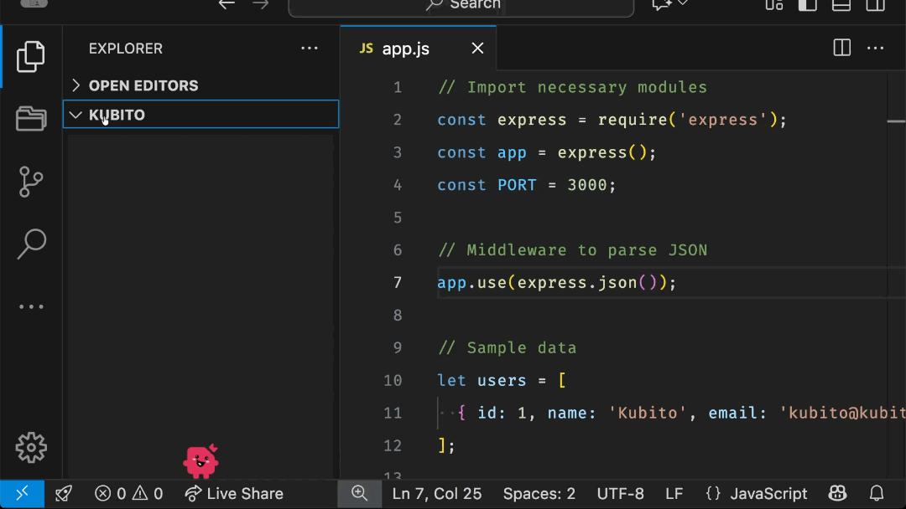

# Kubito

[](https://marketplace.visualstudio.com/items?itemName=Kubit.vscode-kubito)
[](https://marketplace.visualstudio.com/items?itemName=Kubit.vscode-kubito)

> **Meet Kubito, your coding companion that brings joy to your development
> workspace!**

<p align="left">
  
</p>

## ✨ What Kubito Does

- 🤖 **Walks Around**: Kubito walks back and forth in your Explorer
- 🦘 **Autonomous Fun**: Kubito waves, talks and pauses randomly
- 🎮 **Interactive**: Click to make Kubito jump, or grab and throw him with
  realistic gravity, bounce, and momentum across your screen!
- 💬 **Smart Messages**: Context-aware messages that adapt to time and day
  (Monday Blues, Friday Feeling, Working Late)
- 📁 **Development Reactions**: Kubito reacts to your coding activities - file
  saves, Git commits, and pushes
- 📊 **Productivity Tracking**: Smart reminders for breaks and water, plus
  coding metrics to track your productivity
- 🏆 **Coding Metrics**: Track lines of code, session time, and get productivity
  insights
- 🌍 **14 Languages**: Multilingual support for a global audience
- 🎄 **Christmas Mode**: Festive decorations, themed animations, and holiday
  messages during December

## 🚀 Getting Started

### Installation

**VS Code / VSCodium:**

```bash
code --install-extension Kubit.vscode-kubito
```

Or search "Kubito" in the Extensions marketplace:

- **VS Code**:
  [Marketplace](https://marketplace.visualstudio.com/items?itemName=Kubit.vscode-kubito)
- **VSCodium/Gitpod/Theia**:
  [Open VSX](https://open-vsx.org/extension/Kubit/vscode-kubito)

### Usage

1. **Find Him** → Look for "Kubito" section in your Explorer sidebar (left
   panel)
2. **Expand & Watch** → Click to expand if collapsed and watch Kubito start
   walking
3. **Code**: Kubito reacts to your development workflow - save files, commit, or
   push to Git and see his responses!

## 🎮 How to Interact

| Action                 | What Happens                                              |
| ---------------------- | --------------------------------------------------------- |
| 👀 **Hover over him**  | See a nice glow effect                                    |
| 🖱️ **Click on him**    | Make Kubito jump!                                         |
| 🎯 **Drag & Drop**     | Grab and throw Kubito anywhere - he'll fall with physics! |
| ⏰ **Watch and wait**  | Kubito autonomously walks, pauses, and jumps              |
| 🎄 **Christmas Mode**  | Enjoy festive decorations and Kubito with Santa hat       |
| 💾 **Save a file**     | Kubito shows reassuring save reactions                    |
| ✅ **Git commit**      | Kubito celebrates your commits with messages              |
| 🚀 **Git push**        | Kubito cheers when you push your code!                    |
| 💧 **Productivity**    | Kubito reminds you to take breaks, drink water            |
| 📊 **View Metrics**    | Use "Kubito: Show Productivity Metrics" command           |
| 🌍 **Change language** | Messages adapt to your preferred language                 |
| 📁 **Expand/Collapse** | Control Kubito's section like any sidebar panel           |

## ⚙️ Settings

Access in: `Settings > Extensions > Kubito`

- **Auto Show** → Automatically show Kubito when opening VS Code _(default: on)_
- **Language** → Choose from 14 languages or auto-detect from VS Code _(default:
  auto)_
- **Contextual Messages** → Show time and day-appropriate messages _(default:
  on)_
- **Christmas Mode** → Enable festive decorations and themed animations
  _(default: auto - activates in December)_

### 🎬 Event Reactions

Configure Kubito's responses to your development activities:

- **File Save Reactions** → Show reactions when saving files _(default: on)_
- **Git Commit Reactions** → Show reactions when making Git commits _(default:
  on)_
- **Git Push Reactions** → Show reactions when pushing to Git remotes _(default:
  on)_

### 🚀 Productivity Features

Enhance your coding workflow with intelligent reminders and metrics:

- **Smart Reminders** → Enable break, water, and posture reminders _(default:
  on)_
- **Break Interval** → Minutes between break reminders (15-120) _(default: 30)_
- **Water Interval** → Minutes between water reminders (20-180) _(default: 45)_
- **Show Metrics** → Display coding metrics like lines written and session time
  _(default: on)_
- **Metrics Interval** → Minutes between metrics updates (30-300)
  _(default: 60)_

## 🌍 Supported Languages

Kubito speaks your language! All messages, reminders, and productivity features
are fully localized in:

- 🇪🇸 **Spanish** (Español) - Native support
- 🇺🇸 **English** - Native support
- 🇫🇷 **French** (Français) - Native support
- 🇩🇪 **German** (Deutsch) - Native support
- 🇵🇹 **Portuguese** (Português) - Native support
- 🇮🇹 **Italian** (Italiano) - Native support
- 🇳🇱 **Dutch** (Nederlands) - Native support
- 🇯🇵 **Japanese** (日本語) - Full localization
- 🇰🇷 **Korean** (한국어) - Full localization
- 🇨🇳 **Chinese Simplified** (中文简体) - Full localization
- 🇷🇺 **Russian** (Русский) - Full localization
- 🇵🇱 **Polish** (Polski) - Full localization
- 🇸🇦 **Arabic** (العربية) - Full localization (RTL supported)
- 🇹🇷 **Turkish** (Türkçe) - Full localization

Kubito automatically detects your VS Code language setting, or you can manually
select your preferred language in the extension settings.

## 💡 Tips & Tricks

- **Can't see Kubito?** Make sure your Explorer panel is open (folder icon in
  sidebar)
- **Section collapsed?** Click the arrow next to "Kubito" to expand
- **Want more space?** You can resize the Explorer panel by dragging its edge
- **Want to see event reactions?** Try saving a file or making a Git commit -
  Kubito will celebrate with you!
- **Too many reactions?** You can disable file save, commit, or push reactions
  in Settings → Extensions → Kubito
- **🎄 Love Christmas Mode?** Set it to `enabled` in settings to enjoy festive
  decorations year-round!
- **Not a fan of decorations?** Set Christmas Mode to `disabled` in settings to
  keep it off even in December

## 🤝 Support & Feedback

Found a bug or have a suggestion? Reach out to us at
kubit@opendigitalservices.com

If you enjoy this extension, please consider leaving a ⭐ rating

## 🎨 Credits & Acknowledgments

Inspired by the VS Code Pets extension and the need for a personal Kubito while
coding!

Made with ❤️ by the Kubit team.
